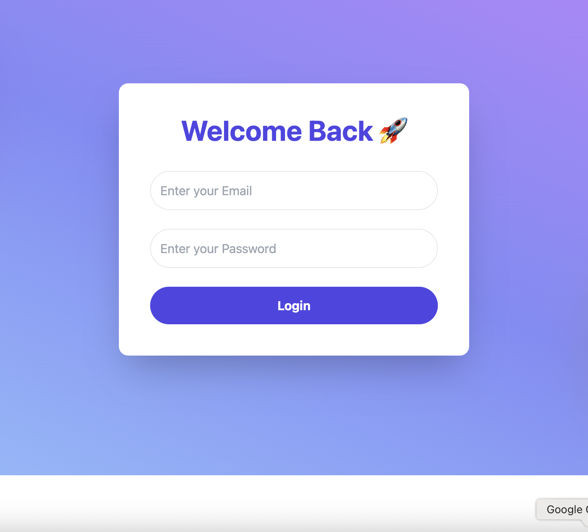
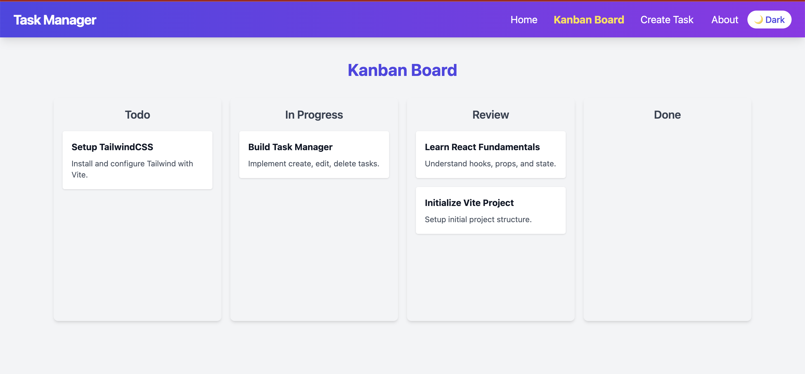

# 🚀 Task Manager App — React + TailwindCSS

> Professional task management web app with Kanban board, drag-and-drop, priority sorting, overdue detection, authentication and beautiful UI.

---

## 🌟 Features

- ✅ Modern Home Page + Login Authentication
- ✅ Protected Routes (Only accessible after login)
- ✅ Create / Edit / Delete Tasks
- ✅ Kanban Board (Todo / In Progress / Review / Done)
- ✅ Drag and Drop between Columns
- ✅ Set Task Priority (High, Medium, Low)
- ✅ Set Due Date + Highlight Overdue Tasks
- ✅ Search Tasks by Title or Description
- ✅ Filter Tasks by Priority
- ✅ Responsive Navbar (Dark Mode Toggle, Logout)
- ✅ Framer Motion Animations (smooth feel)
- ✅ Toast Notifications for actions
- ✅ Mobile Responsive Design
- ✅ Professional Codebase (Re-usable Components, Organized structure)

---

## 📸 Screenshots

|                    Home                    |                    Login                     |                 Kanban Board                 |
| :----------------------------------------: | :------------------------------------------: | :------------------------------------------: |
|  |  |  |

---

## 🛠 Tech Stack

- **React.js** (Functional Components + Hooks)
- **TailwindCSS** (Styling)
- **React Router DOM** (Routing & Protected Routes)
- **Hello Pangea Drag and Drop** (Drag & Drop)
- **Framer Motion** (Animation)
- **React Hot Toast** (Toast Notifications)
- **Vite** (Bundler - Fast and Lightweight)

---

## 🛠 How to Run Locally

```bash
git clone https://github.com/yourusername/task-manager.git
cd task-manager
npm install
npm run dev
Open http://localhost:5173 in your browser.
```
