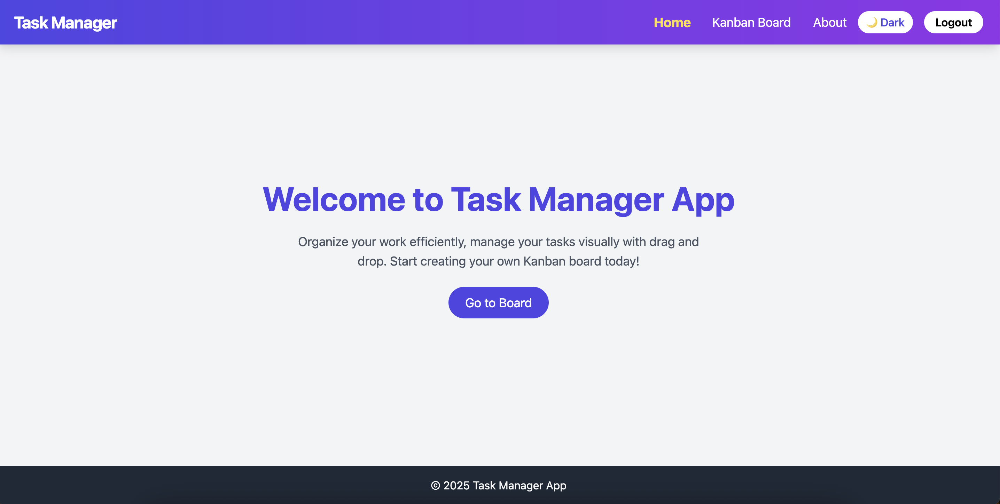

# 🗂️ Task Manager App

A simple and modern task management web application built with **React** and **Tailwind CSS**. This app allows users to create projects, manage tasks, and organize their workflow.


[](https://your-deployed-url.vercel.app/)

---

## 🚀 Features

- 📝 Create and manage tasks
- 📁 Organize tasks under projects
- 🎯 Mark tasks as complete
- 🌓 Light and dark mode support
- 🔒 User authentication (coming soon)

---

## 🖼️ Screenshots

### 🏠 Home Page



### 🧩 Task View


---

## 🛠️ Built With

- [React](https://reactjs.org/)
- [Tailwind CSS](https://tailwindcss.com/)
- [Vite](https://vitejs.dev/)
- [GitHub](https://github.com/sahebghosh/Task-Manager)

---

## 📦 Installation

```bash
git clone https://github.com/sahebghosh/Task-Manager.git
cd Task-Manager
npm install
npm run dev
```
